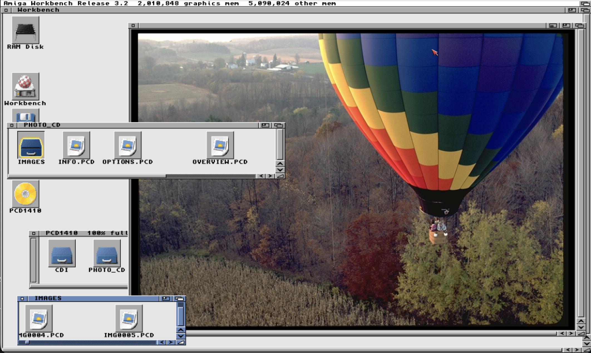
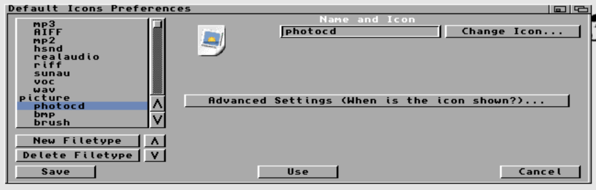
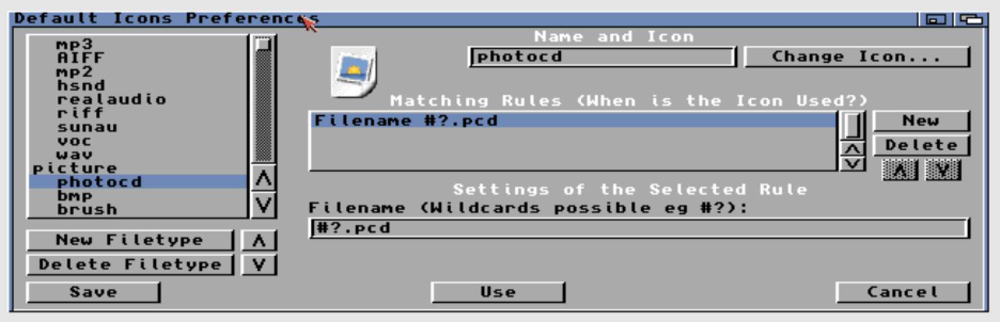
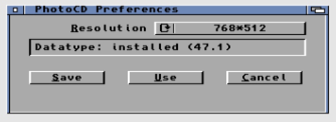

# PhotoCD-DT: Kodak Photo CD DataType for Amiga

`photocd.datatype` adds Kodak Photo CD (`.PCD`) support to the Amiga DataTypes
system.



## Features

- DataTypes-based `.PCD` support for Amiga systems with `picture.datatype` V44+
- Direct RGB decode path inside `photocd.datatype`
- `64Base` (`6144x4096`) support when the original Photo CD companion files are present
- Optional Amiga-side helper tools: `PhotoCD` Prefs and `dtprobe`
- Reproducible host-generated `PhotoCD` DataTypes descriptor

## Requirements

### Runtime

- AmigaOS 3.2 (or another system with `picture.datatype` V44+)
- `PhotoCD Prefs` uses GadTools/Intuition

### Build

- Bebbo's m68k-amigaos-gcc toolchain
- a host C compiler
- `lha` and `icontool` for `make lha`

## Quick Start

Build the main Amiga binaries and generated metadata:

```sh
make
```

This produces:

- `build/amiga/Classes/DataTypes/photocd.datatype`
- `build/amiga/Prefs/PhotoCD`
- `build/amiga/Install`
- `build/amiga/PhotoCD-DT.readme`
- `build/amiga/Env/DataTypes/photocd.prefs`

Build the optional tool and descriptor as needed:

```sh
make descriptor dtprobe
```

Build the distributable archive when you want the packaged release tree and
`.lha` output:

```sh
make lha
```

The shared version source of truth is [version.mk](version.mk). The build uses
that version when generating metadata and Amiga binaries.

## Common Targets

- `make`: build metadata, runtime assets, `photocd.datatype`, and `PhotoCD`
- `make metadata`: regenerate `build/amiga/Install` and `build/amiga/PhotoCD-DT.readme`
- `make runtime-assets`: copy packaged runtime assets such as `photocd.prefs`
- `make dtprobe`: build the Amiga-side DataTypes diagnostic tool at `build/amiga/C/dtprobe`
- `make descriptor`: regenerate `build/amiga/Devs/DataTypes/PhotoCD` with the host-side generator
- `make lha`: assemble `PhotoCD-DT-v<version>/` and `PhotoCD-DT-v<version>.lha`
- `make clean`: remove build products and generated package output

## `64Base` Notes

`64Base` (`6144x4096`) images are supported, but they still require the original
Photo CD companion files in the matching `IPE/.../64BASE` directory layout. The
`.PCD` file alone does not contain the full `64Base` image data.

## Setup

On AmigaOS 3.2 and newer, it is recommended that you add a photocd filetype as
a sub type under picture in your Default Icons Preferences.



Then, make sure to set it to match #?.pcd under Advanced Settings. This way you
will be able to click on PCD files that lack a .info file and they will still
nicely open with MultiView.



## Tools

### `PhotoCD Prefs`

The `PhotoCD Prefs` tool allows you to select the default decoding resolution
and shows you the version of the installed photocd.datatype



### `dtprobe`

Build the optional DataTypes probe with:

```sh
make dtprobe
```

This produces `build/amiga/C/dtprobe`, a small Amiga-side utility that:

- prints the first bytes at offsets `0` and `2048`
- shows the descriptor selected by `ObtainDataTypeA()`
- tries `NewDTObject()` both generically and as a picture object

Example:

```sh
C/dtprobe RAM:IMG0001.PCD
```

### Sample Extraction

The repository includes a helper to reconstruct an ISO from a raw BIN/CUE
image and extract representative `.PCD` files for manual testing:

```sh
python3 tools/extract_photo_cd_samples.py --cue PCD1410.cue --out-dir /tmp/pcd-fixtures
```

### Descriptor Generator

The repository includes a host-side generator for the `PhotoCD` DataTypes
descriptor:

```sh
make descriptor
```

This builds `build/host/make_pcd_descriptor` and rewrites
`build/amiga/Devs/DataTypes/PhotoCD` reproducibly.

The generated descriptor is intentionally pattern-based. Standard Kodak Photo CD
files expose `PCD_IPI` at offset `2048`, so a static first-64-bytes mask is not
enough to identify them reliably. If you later add a comparison hook, the tool
can also attach a raw `DTCD` chunk:

```sh
build/host/make_pcd_descriptor --dtcd path/to/hook -o build/amiga/Devs/DataTypes/PhotoCD
```

## Repository Layout

- `src/`: datatype, prefs tool, diagnostic tool, and decoder sources
- `src/decoder/`: shared Photo CD decoder sources
- `tools/`: fixture extraction and descriptor generator
- `assets/`: package icons and bundled runtime assets
- `build/amiga/`: default Amiga output tree
- `build/amiga/Devs/DataTypes/PhotoCD`: generated DataTypes descriptor

The decoder source is intentionally split into smaller internal translation
units:

- `photocd.c`
- `photocd_core.c`
- `photocd_data.c`
- `photocd_huffman.c`
- `photocd_convert.c`

This keeps the lookup tables, bitstream decoder, conversion code, and control
flow separated without changing the public decoder API.

## Credits

Inspired by PCD-DT35 datatype by Achim Stegemann  
Decoder core basis: Sandy McGuffog and contributors  
Original Photo CD format reverse engineering foundation: Hadmut Danisch

## License

This project is licensed under `GPL-2.0-or-later`. See [LICENSE.md](LICENSE.md).
